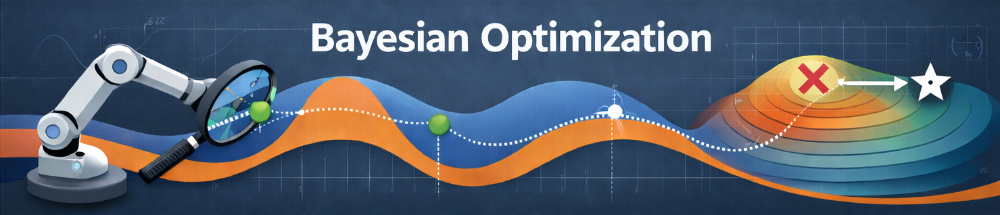

# Bayesian Optimization
This repository contains my work with Bayesian optimization and related topics.
The main goal of this repository is to develop and curate a set of resources
that myself and others can use to better understand (and utilize) Bayesian
optimization.

> [!NOTE]
> Special acknowledgement for content adapted and referenced in this repository
> is owed to my advisor [Professor Aryan Deshwal](
> https://aryandeshwal.github.io) (University of Minnesota) and his special
> topics course entitled _AI for Sequential Decision Making_. Acknowledgement is
> also owed to [Roman Garnett, PhD](https://www.cse.wustl.edu/~garnett/) and his
> brilliant book on Bayesian optimization. For a complete list of supplementary
> materials, please see the [_References_](#references) section below.

> [!TIP]
> Please [raise an issue](
> https://github.com/drewgjerstad/bayesian-optimization/issues/new/choose) if
> you notice any issues, typos, and/or have any suggestions. Thanks!

## 📁 `docs`
This directory contains notes/tutorials on Bayesian optimization and related
topics.

* [**Introduction to Bayesian Optimization**](docs/intro-bayes-opt/intro-bayes-opt.pdf)
* [**Bayesian Decision Theory**](docs/bayes-decision-theory/bayes-decision-theory.pdf)
* [**Gaussian Processes**](docs/gaussian-processes/gaussian-processes.pdf)
* [**Covariance Functions and Kernels**](docs/covariance-kernels/covariance-kernels.pdf)
* [**Model Evaluation and Selection**](docs/model-evaluation/model-evaluation.pdf)
* [**Utility Functions**](docs/utility-functions/utility-functions.pdf)
* [**Acquisition Functions**](docs/acquisition-functions/acquisition-functions.pdf)
* [**GP Regression**](docs/gp-regression/gp-regression.pdf)
* [**GP Classification**](docs/gp-classification/gp-classification.pdf)


## 📁 `examples`
This directory contains notebooks exploring various examples of Bayesian
optimization and its applications.
 * [**BoTorch Tutorials**](examples/botorch_tutorials.ipynb)  
    _This notebook contains tutorials from BoTorch's documentation and_
    _tutorials._
 * [**Introduction to GPyTorch and GAUCHE**](examples/gpytorch_and_gauche.ipynb)  
    _This notebook synthesizes information from GPyTorch and GAUCHE's_
    _documentation regarding Gaussian processes for machine learning and how to_
    _apply them to irregular-structured input representations (i.e., molecular,_
    _graph, etc.)._

## 📁 `src`
This directory contains from-scratch implementations of Bayesian optimization
methods and the methods of related topics.

_Use the commands below to create a new Conda environment with all of the_
_necessary dependencies:_
```bash
conda env create -f bo_env.yml
conda activate bo-env
```
_Note that the commands above should also be used to create an environment_
_to run the notebooks in the `examples` directory._

 * [**`branin.py`**](src/branin.py)  
   _This Python script compares the performance of analytic and monte-carlo_
   _acquisition functions implemented in BoTorch on the Branin function_
   _embedded in higher dimensions. The performance of each acquisition function_
   _is automatically tracked using Weights & Biases. To run the script, use_
   _this command: `python3 branin.py` (after activating the `bo-env`_
   _environment)._


## References
Below is a list of reference texts, papers, and other sources on Bayesian
optimization and related topics. The BibTeX entries can be found in the
[**`assets/bibliography.bib`**](assets/bibliography.bib) file.

### Reference Texts
 * _Bayesian Optimization_ by Roman Garnett (2023)
 * _Bayesian Optimization: Theory and Practice Using Python_ by Peng Liu (2023)
 * _Gaussian Processes for Machine Learning_ by Rasmussen & Williams (2019)

### Papers

### Other
